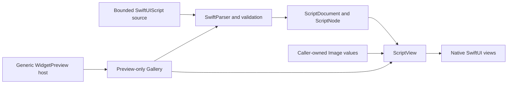

# SwiftUIScript

## Purpose and Scope

SwiftUIScript is an independent Swift Package for compiling a bounded,
declarative SwiftUI presentation subset into an immutable typed document and
rendering that document with native SwiftUI. The package currently contains
four products: `SwiftUIScriptCore`, `SwiftUIScriptCompiler`, `SwiftUIScript`,
and the preview-only `SwiftUIScriptGallery`. The package compatibility
baseline is iOS 26 and macOS 26 with Swift tools 6.3. The compiler uses the
stable SemVer `swift-syntax` 603.0.2 release rather than a development
snapshot. The optional WidgetPreview example may use a newer Xcode host for
Canvas inspection, but that host is not the package compatibility baseline.

The package is a presentation library and preview qualification surface. It
does not provide an application runtime, persistence, networking, credentials,
agent execution, or service integration.

## Responsibilities and Boundaries

- `SwiftUIScriptCore` owns immutable, `Sendable` presentation values and the
  typed node tree.
- `SwiftUIScriptCompiler` parses the accepted source subset with SwiftParser,
  validates it, applies bounded evaluation, and produces one
  `ScriptDocument`.
- `SwiftUIScript` validates a document and maps it to native SwiftUI through
  `ScriptView`; image values are supplied by the caller.
- `SwiftUIScriptGallery` owns static sample source, bundled preview assets,
  and nine native WidgetKit previews. It is not part of the renderer's
  production execution path.
- `Examples/WidgetPreview` owns only a generic iOS 27 App plus Widget
  Extension host for inspecting the Gallery in Xcode Canvas.

No target in this package performs network or filesystem work during source
compilation or rendering. No document node contains executable callbacks or
interactive authority.

The package's source and renderer APIs must remain compilable with Swift 6.3
and the iOS 26/macOS 26 SDKs. A newer example host or Xcode Canvas is a
separate verification surface and must not introduce a package-level
dependency on newer platform APIs.

## Related Designs

| Design | Relationship | Contract Used | Summary | Cautions |
|---|---|---|---|---|
| [Core](Sources/SwiftUIScriptCore/DESIGN.md) | child | immutable typed presentation tree | Defines the value contract shared by compiler and renderer | Node and modifier changes affect both dependants |
| [Compiler](Sources/SwiftUIScriptCompiler/DESIGN.md) | child | bounded source-to-document compilation | Defines accepted syntax, validation, and resource budgets | Unsupported syntax must fail explicitly |
| [Renderer](Sources/SwiftUIScript/DESIGN.md) | child | `ScriptView` and `RenderError` | Maps validated documents to SwiftUI | Host image resolution remains outside the renderer |
| [Gallery](Sources/SwiftUIScriptGallery/DESIGN.md) | child | preview-only WidgetKit surface | Provides static family-specific visual samples | It does not add package runtime authority |
| [WidgetPreview example](Examples/WidgetPreview/DESIGN.md) | used by | public `ScriptWidgetPreview` product contract | Provides an unsigned simulator host for native Canvas inspection | It is not a deployment or signing configuration |
| [Asset notices](THIRD_PARTY_NOTICES.md) | references | bundled image provenance and licenses | Records the external sources for Gallery resources | Asset attribution is not duplicated in module designs |

## Architecture



The package graph is acyclic:

```text
SwiftUIScriptCore
    ↑
SwiftUIScriptCompiler    SwiftUIScript
            ↑             ↑
            └── SwiftUIScriptGallery
                         ↑
                WidgetPreview example
```

## Contracts and Invariants

- A compiler call accepts one source string and either returns one
  `ScriptDocument` or a typed `ScriptError`.
- The default compiler profile bounds source bytes, parser depth, expanded
  nodes, loop iterations, and expression steps. The profile is explicit and
  can be replaced by a caller-owned value.
- The compiler accepts only the implemented declarative subset: immutable
  `let` bindings, literals, supported constructors and modifiers, bounded
  `ForEach`, and finite expressions. It never evaluates arbitrary Swift.
- `ScriptDocument` and its Core values are immutable `Sendable` values. Source
  order is preserved for modifiers.
- `ScriptView` rejects unsupported document versions, missing image bindings,
  and receiver-specific modifier misuse before building the native view.
- Asset references are names in the document; the caller resolves those names
  to immutable `Image` values at the renderer boundary.
- Gallery entries compile and render through the same public compiler and
  renderer path. WidgetKit owns outer size, margins, and container treatment;
  Gallery scripts do not conceal overflow with a fixed whole-card frame.
- The generic example has no App Group, network, storage, credential, or
  signing-account authority. Its project uses generic bundle identifiers and
  is intended for unsigned simulator compilation.

## Runtime Flows

### Compilation and rendering

```text
source
  -> SwiftParser
  -> subset validation and budget accounting
  -> ScriptDocument
  -> ScriptView(document, images:)
  -> native SwiftUI
```

### Preview rendering

```text
preview timeline closure
  -> compile literal source
  -> resolve bundled Image values
  -> prepare TimelineEntry
  -> WidgetKit family proposal
  -> ScriptWidgetPreviewView
```

An unprepared provider produces an explicit unavailable entry. A failed
compilation or image resolution remains a visible preview failure.

## State, Ownership, and Lifecycle

The package has no persistent mutable state. A `ScriptDocument` owns its value
tree, `ScriptView` retains the document and caller-provided image dictionary,
and a Gallery timeline entry owns its prepared render result for the preview
lifetime. Bundled assets are read by the host or preview resource system; the
compiler and renderer do not own external resource discovery.

## Failure, Concurrency, and Constraints

Compilation and renderer construction use typed errors and do not silently
substitute placeholder success. Resource budgets reject excessive source or
expansion before an unbounded tree is produced. SwiftUI presentation occurs
in the native presentation domain; no package API claims background rendering
or arbitrary cross-thread mutation. WidgetKit may constrain or decline a
preview independently of package compilation, so Canvas evidence is kept
separate from library tests.

## Verification and Change Impact

`SwiftUIScriptCompilerTests` cover accepted and rejected syntax, validation,
modifier ordering, loop expansion, arithmetic, and budget failures.
`SwiftUIScriptTests` compare renderer pixels with native SwiftUI, verify image
and receiver failures, and compile/render all nine Gallery scripts under
constrained proposals. The WidgetPreview example is built separately for the
iOS 27 simulator; native Canvas inspection is an example-host concern rather
than a SwiftPM-only claim.

Changes to Core node or modifier contracts require coordinated compiler and
renderer updates. Changes to compiler syntax require success and rejection
tests. Changes to Gallery previews must preserve the preview-only dependency
boundary and the asset notices link.
