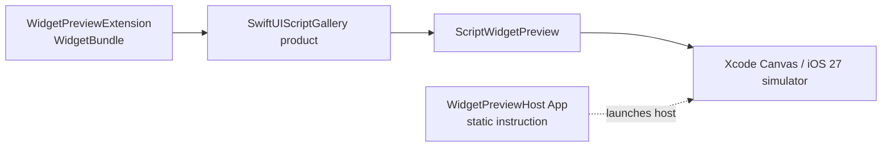

# WidgetPreview Example

## Purpose and Scope

`WidgetPreview` is a generic iOS 27 Xcode host for inspecting the public
`ScriptWidgetPreview` WidgetKit product in Xcode Canvas and an iOS simulator.
It is an example project, not a deployable application or a package runtime.

## Responsibilities and Boundaries

- The App target displays a static instruction only.
- The Widget Extension registers `ScriptWidgetPreview` and receives all sample
  content from the preview-only Gallery product.
- The Xcode project owns the local Swift package reference and simulator build
  settings.
- The example owns no agent, network, storage, credential, App Group, or
  signing-account authority.

## Related Designs

| Design | Relationship | Contract Used | Summary | Cautions |
|---|---|---|---|---|
| [SwiftUIScript package](../../DESIGN.md) | host of | package products and platform bounds | Defines the package graph | The example does not alter package APIs |
| [Gallery](../../Sources/SwiftUIScriptGallery/DESIGN.md) | depends on | public `ScriptWidgetPreview` | Supplies the preview Widget and static resources | Gallery remains preview-only |
| [Asset notices](../../THIRD_PARTY_NOTICES.md) | references | bundled resource provenance | Records Gallery asset licenses | The example adds no asset copies |

## Architecture



## Contracts and Invariants

- The local package reference is `../..`, resolving from the example directory
  to the standalone package root.
- The App bundle identifier is `org.example.swiftuiscript.preview` and the
  Widget Extension identifier is `org.example.swiftuiscript.preview.widget`.
- The project contains no developer-team assignment, provisioning profile, App
  Group, network entitlement, or account-specific signing setting.
- The example targets iOS 27 and supports simulator compilation with
  `CODE_SIGNING_ALLOWED=NO`.
- Only the Widget Extension links `SwiftUIScriptGallery`; the App target has
  no dependency on package internals.

## Runtime Flows

```text
Xcode opens WidgetPreview.xcodeproj
    -> Widget Extension links local SwiftUIScriptGallery
    -> WidgetBundle registers ScriptWidgetPreview
    -> WidgetKit supplies the declared family proposal
    -> Gallery preview content is shown in Canvas or simulator
```

The example does not claim a native Canvas result until an Xcode 27 host
inspection is performed. A successful simulator compile proves only the
project graph and target compatibility.

## State, Ownership, and Lifecycle

The App and extension have no persistent state. WidgetKit owns extension
lifecycle and timeline scheduling. The package owns immutable preview data and
bundled resources for the duration of each prepared entry.

## Failure, Concurrency, and Constraints

The example is unsigned and simulator-only by contract. Signing or device
deployment requires a separate project configuration and is outside this
example. A missing or failed prepared entry remains the Gallery's explicit
diagnostic rather than becoming static success content.

## Verification and Change Impact

The project is checked with an iOS 27 simulator build using
`CODE_SIGNING_ALLOWED=NO`. The package test suite and native Canvas inspection
are separate evidence owned by the package and host workflows respectively.
Changes to the package product name, public Widget initializer, target path,
or bundle identifiers require this project and its package graph to be
rechecked.
