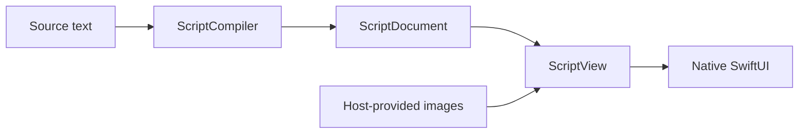

# SwiftUIScript

A SwiftUI-shaped language for describing native interfaces as text.

SwiftUIScript parses a supported subset of Swift syntax into an immutable presentation tree, then renders it with SwiftUI. It does not compile or execute arbitrary Swift code.



## Status and requirements

Experimental. The current implementation supports the visual language listed below, not the complete SwiftUI API or a general-purpose scripting runtime.

- Swift 6.4 and Xcode 27 beta.
- iOS 27 or macOS 27 for the declared package platforms.
- Tests use AppKit and run on macOS.
- SwiftParser and SwiftSyntax are pinned to a development revision in `Package.swift`.

## Installation

Add the package with Swift Package Manager:

```swift
.package(url: "https://github.com/1amageek/SwiftUIScript.git", branch: "main")
```

Add `SwiftUIScriptCompiler` and `SwiftUIScript` to the target that prepares and renders source. A renderer-only target can depend on `SwiftUIScript` without bringing in SwiftSyntax.

| Product | Responsibility |
|---|---|
| `SwiftUIScriptCore` | Immutable document, nodes, and ordered modifiers |
| `SwiftUIScriptCompiler` | Parsing, supported-language validation, bounded expansion |
| `SwiftUIScript` | Native SwiftUI rendering and host image resolution |
| `SwiftUIScriptGallery` | Optional WidgetKit preview samples; not required by the runtime products |

The initial repository uses `main` and has no versioned release yet. Pin a commit revision when reproducible dependency resolution is needed.

## Usage

Prepare the view outside its rendering body, and handle compilation or image-resolution failures at that boundary:

```swift
import SwiftUI
import SwiftUIScript
import SwiftUIScriptCompiler

let source = #"""
VStack(alignment: .leading, spacing: 8) {
    Text("Weather").font(.title2)
    HStack(spacing: 8) {
        Image(systemName: "sun.max.fill")
            .foregroundStyle(Color.orange)
        Text("23°C").font(.system(size: 32, weight: .light))
    }
}
.padding(16)
"""#

let document = try ScriptCompiler().compile(source)
let view = try ScriptView(document)
```

`view` is a SwiftUI `View` that accepts its parent's layout proposal. There is no required card template or fixed canvas size.

For an asset reference such as `Image(asset: "cover")`, provide the image when preparing the view:

```swift
let view = try ScriptView(document, images: ["cover": Image("Cover")])
```

The application owns image loading. The compiler does not access the network or filesystem, and the renderer does not download remote images.

## Supported language

| Area | Supported surface |
|---|---|
| Content | `Text`, `Image(systemName:)`, `Image(asset:)` |
| Layout | `VStack`, `HStack`, `ZStack`, `Spacer`, `Divider` |
| Graphics | `Rectangle`, `RoundedRectangle`, `Circle`, `Ellipse`, `Capsule`, colors, `LinearGradient` |
| Typography | Fonts, foreground colors, tracking, monospaced digits, line limits, multiline alignment |
| Layout modifiers | Fixed and flexible `frame` overloads, padding, background, overlay |
| Appearance | Shape clipping, opacity, offset, rotation, shadow, image resizing and aspect modes, shape fill and stroke |
| Expressions | Immutable `let` values, numeric arithmetic, bounded integer-range `ForEach` |

Modifier order is preserved. Receiver-specific modifiers remain receiver-specific: `resizable()` belongs directly after an image, and `fill` or `stroke` directly after a shape. Unsupported syntax, unknown arguments, invalid values, and budget exhaustion produce typed `ScriptError` values rather than fallback content. `ScriptView` reports typed `RenderError` values for invalid receiver modifiers, unsupported document versions, or missing host images.

`ScriptCompiler.Profile` controls source bytes, expression depth, expanded nodes, iterations, and expression steps. Parser nesting also has an implementation cap of 12. These are compiler bounds, not a guarantee about the rendering cost of every accepted document.

## Widget previews

Open [Examples/WidgetPreview/WidgetPreview.xcodeproj](Examples/WidgetPreview/WidgetPreview.xcodeproj) in Xcode 27, choose the `WidgetPreviewHost` scheme and an iOS 27 simulator, then open [RenderingPreview.swift](Examples/WidgetPreview/Widgets/RenderingPreview.swift) and resume Canvas. This extension-local preview exercises the public compiler and renderer without requiring a package-source Widget preview host.

Additional static gallery samples live under `Sources/SwiftUIScriptGallery`:

| Widget family | Independent previews |
|---|---|
| Small | Focus, Quick note |
| Medium | Music, Flight, Weather, Inbox |
| Large | Location, News, Mood board |

The examples use native WidgetKit preview macros, system-owned family sizes, and bundled images. They are static visual samples, not live services or working playback/search controls. The example host uses generic bundle identifiers and contains no configured developer team.

Package tests exercise source compilation, native pixel comparisons, image failures, and constrained layout proposals. On September 6, 2026, the extension-local Large Widget preview was visually verified in Xcode 27 Canvas on an iPhone 17 Pro simulator: script-generated text, SF Symbol images, shapes, and layout rendered successfully. The package-source Gallery previews still report "No candidates found to host preview" in this environment. Bundled photographs, other families and rendering modes, Home Screen installation, and macOS desktop rendering are not covered by this Canvas result.

## Scope and safety

- The host owns application state, actions, persistence, scheduling, and resource acquisition.
- Source imports, arbitrary function execution, mutable state, event handlers, and a serialized document transport are not implemented.
- This is not a complete security sandbox. Feed the renderer compiler-produced documents and retain host-side resource limits. Public Core constructors do not establish the compiler's full numeric and complexity invariants for hand-built trees.

See [DESIGN.md](DESIGN.md) for module contracts and verification boundaries.

## Development

```sh
scripts/swift-test-timeout.sh 120 --disable-sandbox --no-parallel
swift build --target SwiftUIScriptGallery
xcodebuild -project Examples/WidgetPreview/WidgetPreview.xcodeproj \
    -scheme WidgetPreviewHost -destination 'generic/platform=iOS Simulator' \
    ONLY_ACTIVE_ARCH=YES ARCHS=arm64 CODE_SIGNING_ALLOWED=NO build
```

## License

Source code is available under the [MIT License](LICENSE). Bundled example imagery and third-party dependencies retain their own licenses; see [THIRD_PARTY_NOTICES.md](THIRD_PARTY_NOTICES.md).
