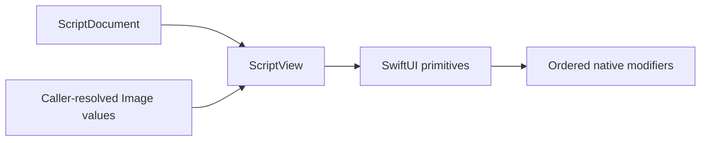

# SwiftUIScript Native Renderer

## Purpose and Scope

This module renders a compiler-produced presentation document using native
SwiftUI. It is a child of the [SwiftUIScript package](../../DESIGN.md) and
contains no card-specific templates or child design units.

## Responsibilities and Boundaries

`ScriptView` owns native presentation and validates the document version,
image bindings, and receiver-specific modifiers before rendering. The caller
owns asset loading and supplies immutable `Image` values. This module does not
fetch images, parse source, perform I/O, or execute actions. Directly
constructed documents are trusted Swift input; source admission belongs to the
compiler.

## Related Designs

| Design | Relationship | Contract Used | Summary | Cautions |
|---|---|---|---|---|
| [Package](../../DESIGN.md) | child | presentation package boundary | Defines the supported module graph | Package constraints remain authoritative |
| [Core](../SwiftUIScriptCore/DESIGN.md) | depends on | immutable typed tree | Supplies portable presentation values | New cases require native handling |
| [Compiler](../SwiftUIScriptCompiler/DESIGN.md) | coordinates with | validated `ScriptDocument` | Rejects unsupported source | Receiver-specific operations precede erasure |
| [Gallery](../SwiftUIScriptGallery/DESIGN.md) | used by | `ScriptView` | Exercises the renderer in previews | Gallery assets stay outside renderer ownership |

## Architecture

## Contracts and Invariants

- Initialization rejects unsupported document versions, missing image IDs, and
  misplaced receiver-specific modifiers before rendering.
- Images become resizable while still `Image`; shapes are filled or stroked
  while still `Shape`.
- Generic modifiers are applied in source order. Fixed and flexible frames use
  their corresponding native overloads.
- The immutable document and image dictionary are retained for the view
  lifetime. Presentation remains in SwiftUI's native presentation domain.
- Child identity is position within the immutable tree; persistent interactive
  state is outside this module.
- Core/compiler bounds limit compiler-produced trees; documents contain no
  executable callback.

## Verification and Change Impact

[Renderer tests](../../Tests/SwiftUIScriptTests) compare pixels and sizes with
equivalent native SwiftUI, verify missing-image failure, and compile/render
all nine Gallery scripts under constrained proposals. The
[Gallery design](../SwiftUIScriptGallery/DESIGN.md) owns native WidgetKit
preview qualification. These checks do not claim every device size or
WidgetKit resource budget.
