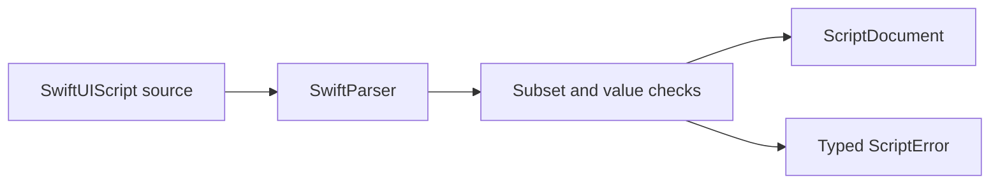

# SwiftUIScriptCompiler

## Purpose and Scope

`SwiftUIScriptCompiler` parses and validates the bounded SwiftUIScript source
subset and emits one `ScriptDocument`. It is a child module of the
[SwiftUIScript package](../../DESIGN.md) and depends on
[SwiftUIScriptCore](../SwiftUIScriptCore/DESIGN.md).

## Responsibilities and Boundaries

The compiler owns SwiftParser/SwiftSyntax parsing, subset admission, constant
and numeric expression evaluation, constructor and modifier validation, loop
expansion, source locations, and resource budgets. It does not execute Swift,
load assets, perform network or filesystem I/O, render SwiftUI, or invent
fallback views.

## Related Designs

| Design | Relationship | Contract Used | Summary | Cautions |
|---|---|---|---|---|
| [Package](../../DESIGN.md) | child | bounded source-to-document boundary | Defines the package-wide limits | The accepted subset is narrower than Swift |
| [Core](../SwiftUIScriptCore/DESIGN.md) | depends on | immutable typed node tree | Receives compiler output | Core does not perform source validation |
| [Renderer](../SwiftUIScript/DESIGN.md) | used by | validated `ScriptDocument` | Renders accepted output | Renderer must not be used to bypass compilation |

## Architecture

## Contracts and Invariants

- Empty, malformed, or parser-recovered source fails with `ScriptError`.
- Unknown constructors, labels, modifiers, identifiers, and receiver-order
  violations fail explicitly.
- Only immutable `let` bindings, literals, supported constructors/modifiers,
  bounded `ForEach`, and finite expressions are evaluated.
- Integer-only arithmetic preserves `Int`, reports overflow, and truncates
  division toward zero; a decimal operand selects finite `Double` arithmetic.
- `ForEach` admits one simple identifier parameter and rejects captures,
  attributes, effects, return types, and typed parameters.
- Source bytes, parser depth, expanded nodes, iterations, and expression steps
  are bounded by `ScriptCompiler.Profile`.
- SwiftParser nesting is capped at `min(Profile.maxDepth, 12)` before lowering.
- `Image(asset:)` remains a host-resolved reference; asset loading belongs to
  the renderer.
- No source is accepted through a regex parser or a silent fallback.

## Verification and Change Impact

Focused compiler tests cover valid lowering and modifier order, loops,
unknown APIs and labels, malformed/recovered syntax, invalid frame and color
values, depth and expansion limits, and arithmetic failures. Syntax changes
require paired success and rejection tests before renderer qualification.
