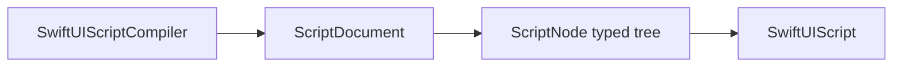

# SwiftUIScriptCore

## Purpose and Scope

`SwiftUIScriptCore` is the value module of the independent
[SwiftUIScript package](../../DESIGN.md). It defines the immutable typed
presentation tree shared by the compiler and native renderer.

## Responsibilities and Boundaries

The module owns `ScriptDocument`, `ScriptNode`, node kinds, ordered modifiers,
colors, fonts, frames, images, gradients, alignments, and shapes. It does not
parse source, resolve assets, construct SwiftUI views, perform I/O, or execute
actions.

## Related Designs

| Design | Relationship | Contract Used | Summary | Cautions |
|---|---|---|---|---|
| [Package](../../DESIGN.md) | child | immutable presentation contract | Places Core in the package graph | Package-level bounds remain authoritative |
| [Compiler](../SwiftUIScriptCompiler/DESIGN.md) | used by | `ScriptDocument` and `ScriptNode` | Lowers validated source into Core values | Compiler validation owns source admission |
| [Renderer](../SwiftUIScript/DESIGN.md) | used by | typed tree and ordered modifiers | Maps Core values to native SwiftUI | Renderer must handle every admitted node case |

## Architecture

## Contracts and Invariants

- `ScriptDocument` and all Core values are immutable `Sendable` values.
- `ScriptDocument.root` contains one typed root node.
- `ScriptNode.modifiers` retains source order and repeated modifiers.
- Fixed and flexible frame contracts remain distinct.
- Receiver-specific image and shape operations are represented explicitly;
  Core never reorders or discards them.
- Compiler-produced numeric values are finite unless the explicit
  `ScriptDimension.infinity` value is used. Core's public value constructors
  store host-provided values and do not revalidate arbitrary numeric input.

## Verification and Change Impact

Compiler tests assert lowered node kinds, frame overloads, and modifier order.
Renderer tests consume the same values and validate native construction.
Changing a Core case or modifier requires coordinated compiler, renderer, and
test updates.
