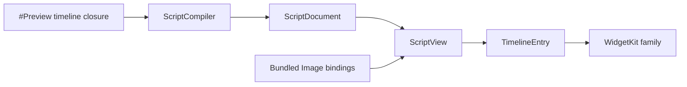

# SwiftUIScript Gallery

## Purpose and Scope

`SwiftUIScriptGallery` is the preview-only visual surface of the
[SwiftUIScript package](../../DESIGN.md). It contains nine independent native
WidgetKit previews for evaluating the bounded compiler and renderer at actual
Widget families.

## Responsibilities and Boundaries

Each `#Preview` owns its literal source, static data, and bundled image
bindings inside its timeline closure. The timeline compiles the source and
prepares a `TimelineEntry` before `ScriptWidgetPreviewView` renders it. The
bridge owns only prepared content and the system container background; WidgetKit
owns outer dimensions and content margins. Gallery code performs no network,
storage, credential, or action work.

## Related Designs

| Design | Relationship | Contract Used | Summary | Cautions |
|---|---|---|---|---|
| [Package](../../DESIGN.md) | child | package presentation boundary | Defines the Gallery product role | This target is preview-only |
| [Compiler](../SwiftUIScriptCompiler/DESIGN.md) | depends on | validated source compilation | Prepares each timeline entry | Compilation failures remain visible |
| [Renderer](../SwiftUIScript/DESIGN.md) | depends on | `ScriptView` and image validation | Renders the prepared document | No card-specific native renderer |
| [WidgetPreview example](../../Examples/WidgetPreview/DESIGN.md) | used by | public `ScriptWidgetPreview` | Hosts the Widget in an iOS simulator project | Example settings do not become package API |
| [Asset notices](../../THIRD_PARTY_NOTICES.md) | references | image provenance and licenses | Records bundled resource sources | Attribution is maintained once at package root |

## Architecture

## Contracts and Invariants

- Nine previews use one source-to-renderer path: Focus and Quick note are
  Small; Music, Flight, Weather, and Inbox are Medium; Location, News, and
  Mood board are Large.
- WidgetKit owns the outer size, corner treatment, container background, and
  content margins. Scripts do not use a fixed whole-card frame or whole-card
  scaling to hide overflow.
- Widget bodies contain no `ScrollView`, `DisclosureGroup`, `Button`, or
  `AppIntent`. Symbols such as transport controls are visual samples only.
- Unsupported source and missing images produce an explicit failure entry;
  the provider without a prepared preview entry reports unavailable content.
- No preview performs network access. The static resource bundle supplies all
  image values.

## Verification and Change Impact

Renderer tests compile and render all nine literal sources under constrained
proposals and retain missing-image failure coverage. The
[WidgetPreview example](../../Examples/WidgetPreview/DESIGN.md) owns the
separate iOS 27 Widget Extension build and native Canvas inspection. A SwiftPM
build or renderer test does not by itself prove native Canvas display, every
device family, or WidgetKit resource budgets.
